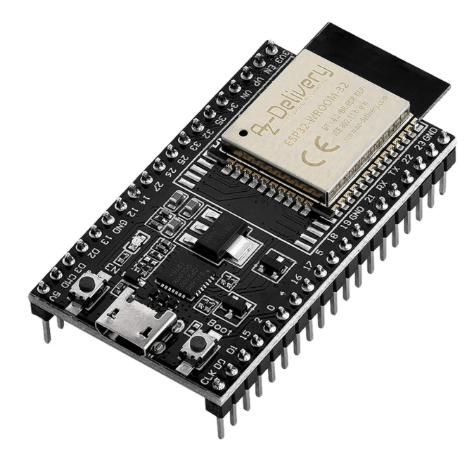
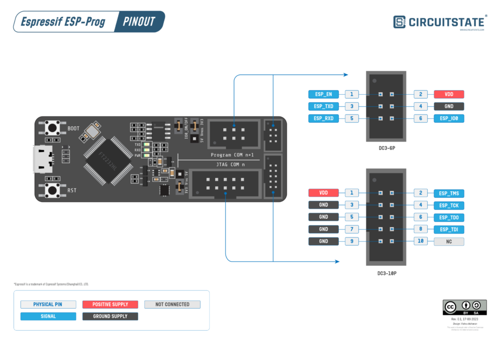

# GardenIrrigationControl

> **Note:** This project is still under construction.

## Table of Contents

- [GardenIrrigationControl](#gardenirrigationcontrol)
  - [Table of Contents](#table-of-contents)
  - [Introduction](#introduction)
  - [Requirements](#requirements)
  - [Hardware](#hardware)
    - [ESP-32 Dev Kit C V4](#esp-32-dev-kit-c-v4)
    - [Relais module](#relais-module)
    - [Debugger ESP-Prog](#debugger-esp-prog)
  - [Circuit Diagram](#circuit-diagram)
  - [Software design](#software-design)

## Introduction

The idea of this project is to control the irrigation of a garden using ESP32 and a relay module.
The ESP32 will be connected to a Wi-Fi network and will be able to receive commands to turn on or off the relay module.
The relay module will be connected to ventils that will control the water flow.
Additionally, the ESP32 measure the level of the water in the tank and send it to a server.

## Requirements

The system should:

- be controlled via a web interface
- be able to receive commands and send data via mqtt
- be able to receive commands via physical buttons
- be able to work without WLAN connection (in case if irrigation is started via physical buttons)
- be able to measure the water level in the tank via capacitive sensor. This sensor has 4-20mA output.

## Hardware

### ESP-32 Dev Kit C V4

- Product name: ESP32 Dev Kit C V4
- Seller: AZ-Delivery

### Relais module

- Product name: 8 Kanal Solid State Relais 5V DC Low Level
- Seller: AZ-Delivery

### Debugger ESP-Prog

## Circuit Diagram

## Software design

The software is written in C++ and uses the Arduino framework.

Classes used in the software are described in the following document: [Class Diagramm](ClassDiagramm.md)

Activity diagrams of the software are described in the following document: [Activity Diagramm](ActivityDiagramm.md)
