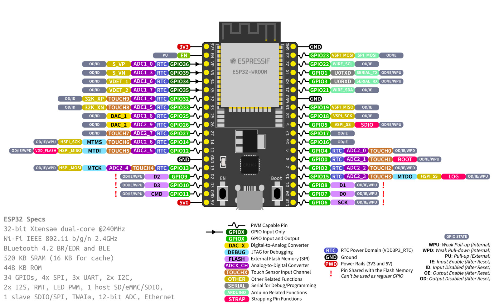

# GardenIrrigationControl <!-- omit from toc -->

> **Note:** This project is still under construction.


- [Introduction](#introduction)
- [Requirements](#requirements)
- [Hardware](#hardware)
  - [ESP-32 Dev Kit C V4](#esp-32-dev-kit-c-v4)
    - [Pinout](#pinout)
  - [Relais module](#relais-module)
  - [Ventil Hunter PGV-101](#ventil-hunter-pgv-101)
- [Implementation](#implementation)
  - [Circuit Diagram](#circuit-diagram)
  - [ESP32 GPIO Assignment for 9 Inputs with Internal Pull-down Resistors and 9 SSR Outputs](#esp32-gpio-assignment-for-9-inputs-with-internal-pull-down-resistors-and-9-ssr-outputs)
  - [Selected GPIOs for Your Application](#selected-gpios-for-your-application)
  - [Important Notes](#important-notes)
  - [Over-The-Air (OTA) Updates](#over-the-air-ota-updates)
    - [OTA Configuration](#ota-configuration)
    - [Using OTA Updates](#using-ota-updates)
    - [Timeout Issues](#timeout-issues)
    - [OTA Status Monitoring](#ota-status-monitoring)

## Introduction

The idea of this project is to control the irrigation of a garden using ESP32 and a relay module.
The ESP32 will be connected to a Wi-Fi network and will be able to receive commands to turn on or off the relay module.
The relay module will be connected to ventils that will control the water flow.
Additionally, the ESP32 measure the level of the water in the tank and send it to a server.

## Requirements

The system should:

- be controlled via a web interface
- be able to receive commands and send data via mqtt
- be able to receive commands via physical buttons
- be able to work without WLAN connection (in case if irrigation is started via physical buttons)
- be able to measure the water level in the tank via capacitive sensor. This sensor has 4-20mA output.

## Hardware

### ESP-32 Dev Kit C V4


- Product name: ESP32 Dev Kit C V4
- Seller: AZ-Delivery

#### Pinout



Source: [ESP32 Pinout](https://www.cnx-software.com/wp-content/uploads/2022/09/ESP32-DevkitC-V4-pinout-diagram.jpg)

### Relais module


- Product name: 8 Kanal Solid State Relais 5V DC Low Level
- Seller: AZ-Delivery

### Ventil Hunter PGV-101

## Implementation

### Circuit Diagram


### ESP32 GPIO Assignment for 9 Inputs with Internal Pull-down Resistors and 9 SSR Outputs

### Selected GPIOs for Your Application

| Function | Description | GPIO | Board Label | Internal Pull-down | Notes |
|----------|-------------|------|------------|-----------|-------|
| **Inputs (with Internal Pull-down)** |
| Input 1 | Digital Input | GPIO14 | 14 | ✓ | Internal pull-down ~45kΩ |
| Input 2 | Digital Input | GPIO13 | 13 | ✓ | Internal pull-down ~45kΩ |
| Input 3 | Digital Input | GPIO15 | 15 | ✓ | Internal pull-down ~45kΩ |
| Input 4 | Digital Input | GPIO2 | 2 | ✓ | Internal pull-down ~45kΩ |
| Input 5 | Digital Input | GPIO4 | 4 | ✓ | Internal pull-down ~45kΩ |
| Input 6 | Digital Input | GPIO16 | 16 | ✓ | Internal pull-down ~45kΩ |
| Input 7 | Digital Input | GPIO17 | 17 | ✓ | Internal pull-down ~45kΩ |
| Input 8 | Digital Input | GPIO5 | 5 | ✓ | Internal pull-down ~45kΩ |
| Input 9 | Digital Input | GPIO18 | 18 | ✓ | Internal pull-down ~45kΩ |
| **Outputs (for SSR modules with Low-Level-Trigger)** |
| Relay 1 | Low-Level-Trigger | GPIO27 | 27 | - | Activation by LOW signal. During booting, this GPIO set the output for < = 1 second to LOW. |
| Relay 2 | Low-Level-Trigger | GPIO26 | 26 | - | Activation by LOW signal |
| Relay 3 | Low-Level-Trigger | GPIO25 | 25 | - | Activation by LOW signal |
| Relay 4 | Low-Level-Trigger | GPIO33 | 33 | - | Activation by LOW signal |
| Relay 5 | Low-Level-Trigger | GPIO32 | 32 | - | Activation by LOW signal. During booting, this GPIO set the output for < = 1 second to LOW. |
| Relay 6 | Low-Level-Trigger | GPIO23 | 23 | - | Activation by LOW signal |
| Relay 7 | Low-Level-Trigger | GPIO22 | 22 | - | Activation by LOW signal |
| Relay 8 | Low-Level-Trigger | GPIO21 | 21 | - | Activation by LOW signal |
| Relay 9 | Low-Level-Trigger | GPIO19 | 19 | - | Activation by LOW signal |

### Important Notes

1. **Avoided GPIOs:**
   - GPIO12: Avoided due to potential boot issues.
   - GPIO34, GPIO35, GPIO36, GPIO39: These are input-only and are not support pull-up or pull-down resistors.

2. **Special Considerations:**
   - Internal Pull-down Resistors: The ESP32 has built-in programmable pull-down resistors (approximately 45kΩ) that can be enabled via software, eliminating the need for external pull-down resistors.

3. **Low-Level-Trigger SSRs:**
   - Since SSR modules with Low-Level-Trigger are used, a LOW signal is needed to activate and a HIGH signal to deactivate.
   - Initially, all SSR outputs should be set to HIGH to avoid unintended activation.

### Over-The-Air (OTA) Updates

This project supports OTA (Over-The-Air) updates, allowing you to upload new firmware wirelessly without physical access to the ESP32.

#### OTA Configuration

#### Using OTA Updates

1. Find your ESP32's IP address (check your router or serial monitor)

2. Update `platformio.ini` in the `[env:esp32dev-ota]` section:

   ```ini
   upload_port = 192.168.x.x  ; Replace with your ESP32's IP
   ```

3. In OtaSecret.h , set your OTA password:

   ```cpp
   #define OTA_PASSWORD "YourSecurePassword123"
   ```

4. Upload the firmware:

   ```bash
   pio run -e esp32dev-ota -t upload
   ```

#### Timeout Issues

If you encounter timeout issues during OTA updates, try to ncrease timeout values in platformio.ini:

   ```ini
   upload_flags = 
     --port=3232
     --timeout=30
   ```

#### OTA Status Monitoring

The system provides detailed OTA status logging:

- **Setup**: Logs when OTA is initialized
- **Progress**: Shows upload progress percentage
- **Errors**: Detailed error messages for troubleshooting
- **Completion**: Confirms successful updates

When an OTA update is in progress, all irrigation operations are paused to ensure update stability.