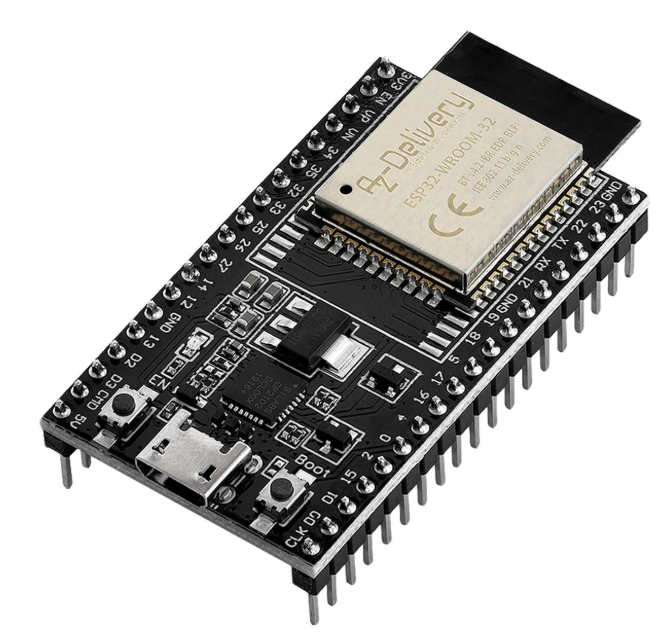
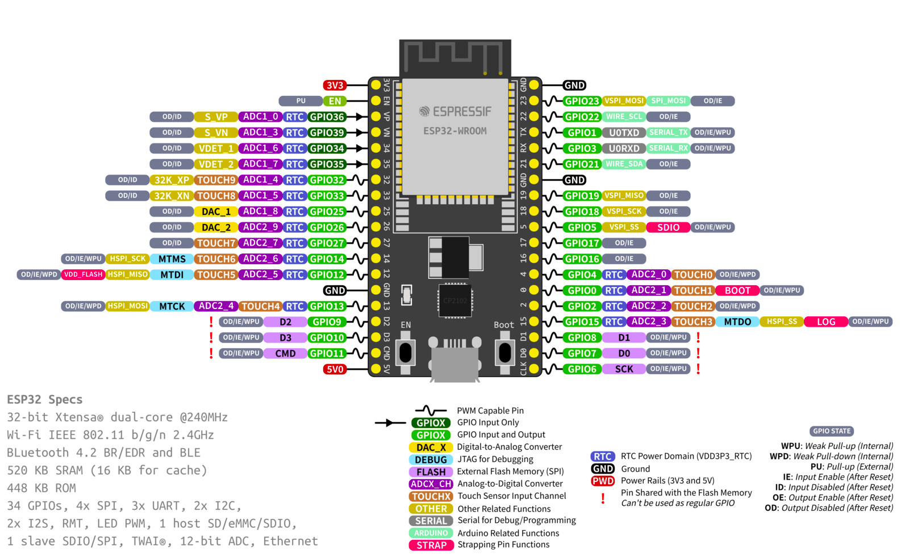
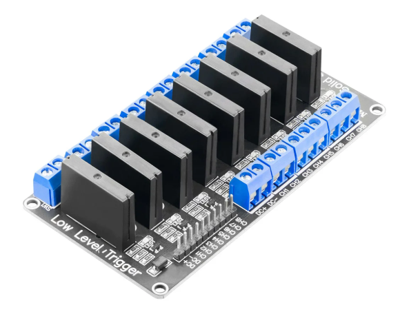
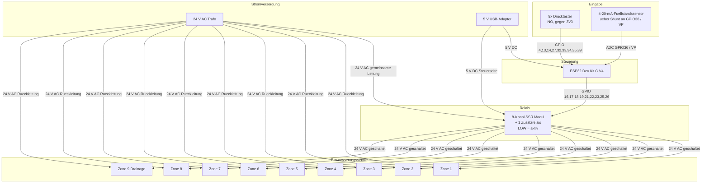
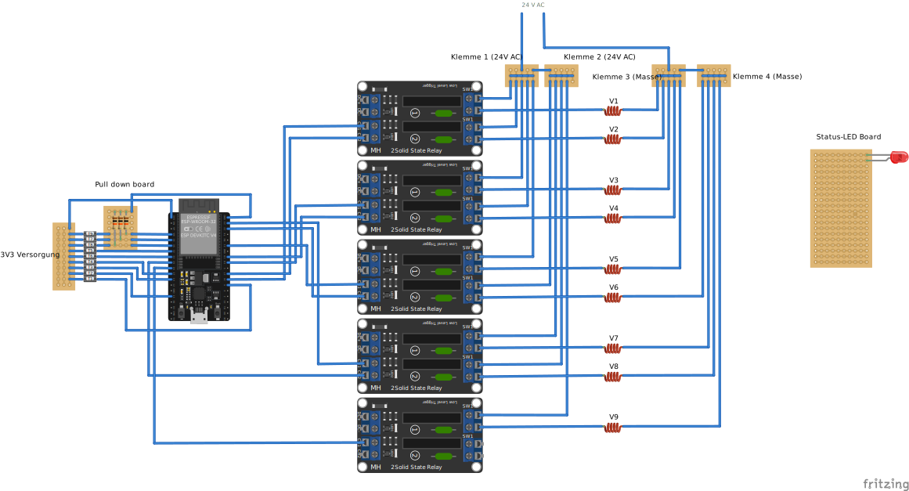
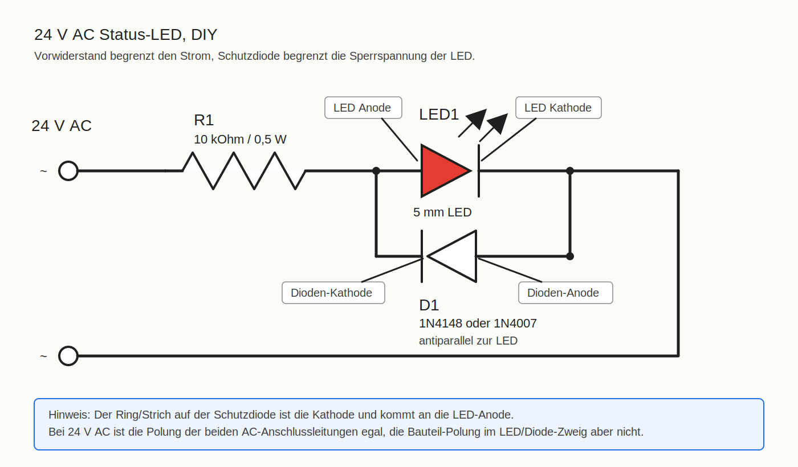
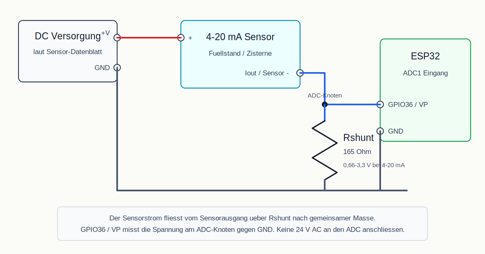

# GardenIrrigationControl

> Das Projekt befindet sich noch im Aufbau.


## Inhaltsverzeichnis

- [Projektziel](#projektziel)
- [Anforderungen](#anforderungen)
- [Entwicklungsumgebung](#entwicklungsumgebung)
- [Hardware](#hardware)
  - [Stueckliste](#stueckliste)
  - [ESP32 Dev Kit C V4](#esp32-dev-kit-c-v4)
  - [SSR-Relaismodul](#ssr-relaismodul)
  - [Hunter PGV-101 Ventile](#hunter-pgv-101-ventile)
- [Verschaltung](#verschaltung)
  - [Systemuebersicht](#systemuebersicht)
  - [Steckplatinenansicht](#steckplatinenansicht)
  - [Spannungsversorgung](#spannungsversorgung)
  - [SSR-Modul und Ventile](#ssr-modul-und-ventile)
  - [Taster](#taster)
  - [Status-LED je Zone](#status-led-je-zone)
  - [Wasserstandssensor mit Shunt-Widerstand](#wasserstandssensor-mit-shunt-widerstand)
- [GPIO-Belegung](#gpio-belegung)
  - [Zonenbelegung](#zonenbelegung)
  - [Reservierte und gemiedene Pins](#reservierte-und-gemiedene-pins)
- [Hardware-Risiken und Hinweise](#hardware-risiken-und-hinweise)
- [Hardwaretests](#hardwaretests)
- [OTA-Updates](#ota-updates)

## Projektziel

GardenIrrigationControl steuert eine Gartenbewaesserung mit einem ESP32, einem
SSR-Relaismodul und 24-V-AC-Magnetventilen. Die Bewaesserungszonen koennen per
MQTT, Web-/Netzwerklogik oder ueber physische Taster geschaltet werden. Zusaetzlich
kann der Fuellstand einer Zisterne ueber einen 4-20-mA-Sensor erfasst werden.

## Anforderungen

Das System soll:

- ueber eine Web- bzw. Netzwerk-Schnittstelle steuerbar sein
- Befehle und Statusdaten per MQTT verarbeiten
- physische Taster fuer manuelle Bewaesserung unterstuetzen
- auch ohne WLAN manuell bedienbar bleiben
- den Wasserstand einer Zisterne ueber einen kapazitiven 4-20-mA-Sensor messen
- Over-The-Air-Updates fuer die Firmware unterstuetzen

## Entwicklungsumgebung

Dieses Projekt erwartet Secret- und Konfigurations-Header ausserhalb des
Repositorys.

Setup-Skript ausfuehren:

```powershell
powershell -ExecutionPolicy Bypass -File .\scripts\setup_secrets.ps1
```

Oder unter Windows:

```bat
scripts\setup_secrets.bat
```

Das Skript erstellt oder aktualisiert diese Dateien einen Ordner oberhalb des
Repository-Roots:

- `_secrets/WifiSecret.h`
- `_secrets/MqttSecret.h`
- `_secrets/OtaSecret.h`
- `_config/MqttConfig.h`

Existierende Dateien werden vorher mit Zeitstempel gesichert, z. B.
`WifiSecret.h.20260503-153000.bak`.

## Hardware

### Stueckliste

| Menge | Bauteil | Modell / Wert | Zweck / Hinweis |
| ---: | --- | --- | --- |
| 1 | Microcontroller | ESP32 Dev Kit C V4, AZ-Delivery | Steuerung, WLAN, MQTT, OTA |
| 1 | Relaismodul | 8-Kanal SSR 5 V DC, Low-Level-Trigger | Schaltet Zone 1 bis 8 |
| 1 | Zusatzrelais | 24 V AC geeignet, Low-Level-Trigger | Schaltet Zone 9 / Drainage |
| 9 | Magnetventil | Hunter PGV-101 | 24-V-AC-Bewaesserungsventile |
| 9 | Drucktaster | NO, normally open | Manuelle Zonensteuerung |
| 1 | Trafo | 24 V AC, ausreichend dimensioniert | Versorgung der Magnetventile |
| 1 | USB-Netzteil | 5 V DC | Versorgung des ESP32 |
| 1 | 4-20-mA-Sensor | kapazitiver Fuellstandssensor | Zisternenfuellstand |
| 1 | Shunt-Widerstand | ca. 165 Ohm | Wandelt 4-20 mA auf ADC-Spannung |
| 3 | Pull-down-Widerstand | 10 kOhm | Fuer GPIO 34, 35 und 39 |
| optional 9 | Pull-up-Widerstand | 10 kOhm | Je SSR-Eingang nach 3V3, wenn noetig |
| optional 9 | Status-LED | 5 mm, Farbe nach Wunsch | Anzeige des echten 24-V-AC-Ausgangs |
| optional 9 | LED-Vorwiderstand | 6,8 kOhm / 0,5 W | Strombegrenzung fuer 24 V AC |
| optional 9 | Schutzdiode | 1N4148 oder 1N4007 | Antiparallel zur Status-LED |
| optional 9 | LED-Halter | 5-mm-Frontclip | Montage in der Gehaeusefront |
| optional | Schrumpfschlauch / Litze | 0,14-0,25 mm2 | Isolation und Verdrahtung |

### ESP32 Dev Kit C V4



- Produkt: ESP32 Dev Kit C V4
- Anbieter: AZ-Delivery
- Versorgung: 5 V ueber USB, intern 3,3 V Logikpegel

Pinout:



Quelle: [ESP32 Pinout](https://www.cnx-software.com/wp-content/uploads/2022/09/ESP32-DevkitC-V4-pinout-diagram.jpg)

### SSR-Relaismodul



- Produkt: 8-Kanal Solid State Relais, 5 V DC, Low-Level-Trigger
- Anbieter: AZ-Delivery
- Steuerseite: 5 V DC
- Lastseite: 24 V AC fuer Magnetventile

Wichtig: LOW am SSR-Eingang aktiviert den Kanal, HIGH deaktiviert ihn.

### Hunter PGV-101 Ventile

- 9 Magnetventile fuer die Bewaesserungszonen
- Betrieb mit 24 V AC
- Zone 9 ist als Zusatz- bzw. Drainagezone vorgesehen

## Verschaltung

### Systemuebersicht


```mermaid
graph TD
    subgraph PSU ["Stromversorgung"]
        V24["24 V AC Trafo"]
        V5["5 V USB-Adapter"]
    end

    subgraph CTRL ["Steuerung"]
        ESP32["ESP32 Dev Kit C V4"]
    end

    subgraph IO ["Eingabe"]
        BTN["9x Drucktaster\nNO, gegen 3V3"]
        SENSOR["4-20-mA-Fuellstandssensor\nueber Shunt an GPIO36 / VP"]
    end

    subgraph REL ["Relais"]
        SSR["8-Kanal SSR Modul\n+ 1 Zusatzrelais\nLOW = aktiv"]
    end

    subgraph VALVES ["Bewaesserungsventile"]
        V1["Zone 1"]
        V2["Zone 2"]
        V3["Zone 3"]
        V4["Zone 4"]
        V5X["Zone 5"]
        V6["Zone 6"]
        V7["Zone 7"]
        V8["Zone 8"]
        V9["Zone 9 Drainage"]
    end

    V5 -->|"5 V DC"| ESP32
    V5 -->|"5 V DC Steuerseite"| SSR
    ESP32 -->|"GPIO 16,17,18,19,21,22,23,25,26"| SSR
    BTN -->|"GPIO 4,13,14,27,32,33,34,35,39"| ESP32
    SENSOR -->|"ADC GPIO36 / VP"| ESP32
    V24 -->|"24 V AC gemeinsame Leitung"| SSR
    SSR -->|"24 V AC geschaltet"| V1 & V2 & V3 & V4 & V5X & V6 & V7 & V8 & V9
    V24 -->|"24 V AC Rueckleitung"| V1 & V2 & V3 & V4 & V5X & V6 & V7 & V8 & V9
```

Fallback-Grafik ohne Mermaid-Renderer:
[docs/system_overview.svg](docs/system_overview.svg)

### Steckplatinenansicht

<figure>
  
  <figcaption>Steckplatinenansicht der ESP32-, SSR-, Taster- und Ventilverdrahtung.</figcaption>
</figure>

Die Grafik ist aus der Fritzing-Datei `_assets/IrrigationCircuit.fzz`
abgeleitet und dient als visuelle Aufbauhilfe zur nachfolgenden
Verdrahtungsbeschreibung.

### Spannungsversorgung

```text
Steckdose 230 V AC
|
+-- 24 V AC Trafo
|   +-- L1 -> SSR COM / gemeinsame Eingangsleitung
|   +-- L2 -> gemeinsame Rueckleitung aller Ventile
|
+-- 5 V USB-Netzteil
    +-- USB -> ESP32
    +-- 5 V -> SSR VCC / Steuerseite
    +-- GND -> ESP32 GND und SSR GND
```

Wichtig: ESP32-GND und SSR-Steuer-GND muessen verbunden sein. Die 24-V-AC-Seite
bleibt galvanisch von der Steuerseite getrennt.

### SSR-Modul und Ventile

Verdrahtung je Zone:

```text
ESP32 GPIO, z. B. GPIO16 -----------------> SSR IN1
ESP32 GND --------------------------------> SSR GND
5 V DC -----------------------------------> SSR VCC

24 V AC Trafo L1 -------------------------> SSR COM
SSR NO / Ausgang -------------------------> Ventil Zone 1, Klemme A
24 V AC Trafo L2 -------------------------> Ventil Zone 1, Klemme B
```

Vereinfachter Stromkreis:

```text
24 V AC L1 -- SSR COM -- SSR Ausgang -- Ventil -- 24 V AC L2
```

Bei LOW am Relais-GPIO schliesst der SSR-Kanal und das Ventil oeffnet. Bei HIGH
ist der Kanal aus und das Ventil geschlossen. Die Firmware setzt die Relaispins
beim Start zuerst auf HIGH und schaltet sie danach als OUTPUT, damit die
Ausgaenge moeglichst inaktiv starten.

### Taster

Jeder Taster ist als normally-open-Taster gegen 3V3 verdrahtet:

```text
3V3 ---- Taster ---- ESP32 GPIO
GND ---- Pull-down -- ESP32 GPIO
```

Fuer GPIO 4, 13, 14, 27, 32 und 33 wird der interne Pull-down des ESP32 genutzt.
GPIO 34, 35 und 39 sind input-only und besitzen keinen internen Pull-down; diese
drei Taster benoetigen jeweils einen externen 10-kOhm-Pull-down nach GND.

### Status-LED je Zone

Wenn eine LED den realen Schaltzustand anzeigen soll, wird sie parallel zum
jeweiligen 24-V-AC-Ventilausgang angeschlossen. Dadurch zeigt sie den tatsaechlich
geschalteten Ausgang, nicht nur den GPIO-Zustand.

<figure>
  
  <figcaption>24 V AC Status-LED mit Vorwiderstand R1 und antiparalleler Schutzdiode D1.</figcaption>
</figure>

Stueckliste pro LED:

| Menge | Bauteil | Wert / Typ | Hinweis |
| ---: | --- | --- | --- |
| 1 | LED | 5 mm, Farbe nach Wunsch | Lange Anschlussfahne ist meist Anode |
| 1 | Widerstand R1 | 6,8 kOhm / 0,5 W | 10 kOhm geht, wenn es dezenter leuchten soll |
| 1 | Diode D1 | 1N4148 oder 1N4007 | Ring / Strich markiert die Kathode |
| 1 | LED-Halter | 5-mm-Frontclip | Passend zur Gehaeusefront |
| 1 | Schrumpfschlauch | passend | Alle blanken Kontakte isolieren |
| optional | Litze | 0,14-0,25 mm2 | Anschluss an Klemme oder Platine |

Verdrahtung:

1. R1 in Reihe zur LED einbauen.
2. D1 direkt antiparallel zur LED anschliessen.
3. Dioden-Kathode, also Ring / Strich, an die LED-Anode anschliessen.
4. Dioden-Anode an die LED-Kathode anschliessen.
5. LED-Schaltung parallel zum jeweiligen 24-V-AC-Ventilausgang anschliessen.
6. Alle blanken Anschluesse mit Schrumpfschlauch isolieren.

Dimensionierung:

```text
24 V AC * 1,414 = ca. 34 V Spitzenspannung
I = (34 V - ca. 2 V) / 6800 Ohm = ca. 4,7 mA Spitzenstrom
```

Ein 0,5-W-Widerstand ist empfehlenswert, weil er kuehler bleibt und mechanisch
robuster ist.

### Wasserstandssensor mit Shunt-Widerstand

Der Wasserstandssensor liefert ein 4-20-mA-Signal. Der ESP32 misst aber keine
Stroeme direkt, sondern eine Spannung am ADC. Deshalb wird der Sensorstrom durch
einen Shunt-Widerstand gefuehrt. Die Spannung ueber diesem Widerstand liegt am
ADC-Pin GPIO36 / VP an.

<figure>
  
  <figcaption>4-20-mA-Sensor mit 165-Ohm-Shunt am ADC-Eingang GPIO36 / VP.</figcaption>
</figure>

Stueckliste fuer den Messeingang:

| Menge | Bauteil | Wert / Typ | Hinweis |
| ---: | --- | --- | --- |
| 1 | Fuellstandssensor | 4-20 mA, kapazitiv | Versorgung laut Sensor-Datenblatt |
| 1 | Shunt-Widerstand | ca. 165 Ohm | Wandelt 4-20 mA in ca. 0,66-3,3 V |
| optional 1 | Serienwiderstand | 1 kOhm | Zusaetzlicher Schutz vor dem ADC-Pin |
| optional 1 | Kondensator | 100 nF | Gegen GND am ADC-Knoten zur Glaettung |

Verdrahtung bei einem typischen 2-Draht-4-20-mA-Sensor:

```text
DC Versorgung + ---- Sensor + 
Sensor - / Iout ---- ADC-Knoten ---- GPIO36 / VP
ADC-Knoten --------- Rshunt 165 Ohm ---- GND
DC Versorgung GND ---------------------- GND
ESP32 GND ------------------------------ GND
```

Der ADC-Knoten ist die Verbindung aus Sensor-Ausgang, Shunt-Widerstand und
GPIO36 / VP. Der Shunt liegt von diesem Knoten nach GND. ESP32-GND und die
Masse der Sensorspeisung muessen verbunden sein, damit der ADC eine definierte
Bezugsspannung hat.

Dimensionierung:

```text
U = I * R
Umin = 0,004 A * 165 Ohm = 0,66 V
Umax = 0,020 A * 165 Ohm = 3,30 V
Pmax = I^2 * R = 0,020 A * 0,020 A * 165 Ohm = 0,066 W
```

Ein 0,25-W-Widerstand reicht elektrisch aus; 0,5 W ist mechanisch robuster. Der
ADC-Pin GPIO36 / VP darf maximal 3,3 V sehen. Daher darf die Sensorversorgung
niemals direkt auf GPIO36 gelegt werden, und 24 V AC gehoert ausschliesslich auf
die Ventilseite, nicht auf den Messeingang.

Firmware-Bezug:

| Firmware-Wert | Bedeutung |
| --- | --- |
| `WATER_LEVEL_SENSOR_PIN = 36` | ADC-Eingang GPIO36 / VP |
| `WATER_LEVEL_ADC_MIN = 820` | ca. 0,66 V bei 4 mA |
| `WATER_LEVEL_ADC_MAX = 4095` | ca. 3,3 V bei 20 mA |

## GPIO-Belegung

### Zonenbelegung

Diese Tabelle entspricht der Firmware in `src/config/config.h`.

| Zone | Funktion | Taster-GPIO | Taster-Board-Label | Relais-GPIO | Relais-Board-Label | SSR-Kanal | Hinweis |
| --- | --- | ---: | --- | ---: | --- | --- | --- |
| 1 | Bewaesserung | 4 | D4 | 16 | RX2 | IN1 | interner Pull-down |
| 2 | Bewaesserung | 13 | D13 | 17 | TX2 | IN2 | interner Pull-down |
| 3 | Bewaesserung | 14 | D14 | 18 | D18 | IN3 | interner Pull-down |
| 4 | Bewaesserung | 27 | D27 | 19 | D19 | IN4 | interner Pull-down |
| 5 | Bewaesserung | 32 | D32 | 21 | D21 | IN5 | interner Pull-down |
| 6 | Bewaesserung | 33 | D33 | 22 | D22 | IN6 | interner Pull-down |
| 7 | Bewaesserung | 34 | D34 | 23 | D23 | IN7 | externer 10-kOhm-Pull-down noetig |
| 8 | Bewaesserung | 35 | D35 | 25 | D25 | IN8 | externer 10-kOhm-Pull-down noetig |
| 9 | Drainage / Zusatzventil | 39 | VN | 26 | D26 | Zusatzrelais | externer 10-kOhm-Pull-down noetig |

Weitere Sensorik:

| Funktion | GPIO | Board-Label | Hinweis |
| --- | ---: | --- | --- |
| Wasserstand 4-20 mA | 36 | VP | ADC1, ueber Shunt-Widerstand |

ADC-Vorgaben in der Firmware:

| Wert | Bedeutung |
| --- | --- |
| `WATER_LEVEL_ADC_MIN = 820` | ca. 0,66 V bei 4 mA an 165 Ohm |
| `WATER_LEVEL_ADC_MAX = 4095` | ca. 3,3 V bei 20 mA an 165 Ohm |

### Reservierte und gemiedene Pins

| GPIO | Grund |
| --- | --- |
| 0, 2, 5, 12, 15 | Strapping-Pins, bleiben frei |
| 1, 3 | UART TX/RX fuer Serial / OTA |
| 6 bis 11 | ESP32-Flash, nicht verwenden |
| 34, 35, 39 | input-only, kein interner Pull-down |
| 36 / VP | input-only, fuer Wasserstandssensor reserviert |

## Hardware-Risiken und Hinweise

| Problem | Status / Risiko | Empfehlung |
| --- | --- | --- |
| 8-Kanal-SSR reicht nur fuer 8 Zonen | geloest | Zone 9 nutzt ein separates Zusatzrelais |
| LOW-active SSR-Eingaenge koennen beim Reset floaten | niedrig | Firmware startet Relaispins inaktiv; optional 10-kOhm-Pull-up je SSR-Eingang pruefen |
| Hunter PGV-101 benoetigt 24 V AC | geloest | 24-V-AC-Trafo und AC-faehige Relais-/SSR-Lastseite verwenden |
| Kurzschluss / Ueberstrom auf Ventilseite | mittel | Feinsicherung 1 A pro Ventilkreis oder Gruppenabsicherung vorsehen |
| GPIO 34, 35 und 39 ohne Pull-down | relevant | Je Taster einen externen 10-kOhm-Pull-down nach GND verbauen |

## Hardwaretests

Der Test `test_embedded_esp32_gpio_io` laeuft direkt auf dem per USB
angeschlossenen ESP32 und prueft die GPIOs:

- Ausgangs-GPIOs werden kurz auf LOW und HIGH gesetzt und per `digitalRead()`
  zurueckgelesen.
- Eingangs-GPIOs muessen im Ruhezustand LOW sein.
- Fuer jeden Eingang fordert der Test im Terminal auf, den Eingang kurz auf HIGH
  zu bringen und danach wieder loszulassen.

Sicherheit vor dem Test: Der Test schaltet die Ausgangs-GPIOs kurz auf LOW. Wenn
das SSR-Modul angeschlossen ist, kann dadurch ein Relais aktivieren. Fuer einen
reinen ESP32-Test daher SSR-Modul oder Ventilversorgung trennen.

Ausfuehren:

```powershell
pio test -e az-delivery-devkit-v4-usb -f test_embedded_esp32_gpio_io
```

Falls `pio` in der aktuellen Shell nicht im `PATH` liegt:

```powershell
C:\Users\paul\.platformio\penv\Scripts\pio.exe test -e az-delivery-devkit-v4-usb -f test_embedded_esp32_gpio_io
```

Ein erfolgreicher Lauf endet mit `PASSED`.

## OTA-Updates

Dieses Projekt unterstuetzt OTA-Updates, damit neue Firmware ohne direkten
USB-Zugriff auf den ESP32 geladen werden kann.

1. IP-Adresse des ESP32 ermitteln, z. B. im Router oder ueber den Serial Monitor.
2. In `platformio.ini` im Environment fuer OTA den Upload-Port setzen:

   ```ini
   upload_port = 192.168.x.x
   ```

3. In `OtaSecret.h` das OTA-Passwort setzen:

   ```cpp
   #define OTA_PASSWORD "YourSecurePassword123"
   ```

4. Firmware hochladen:

   ```bash
   pio run -e esp32dev-ota -t upload
   ```

Bei Timeout-Problemen kann in `platformio.ini` ein groesserer Timeout gesetzt
werden:

```ini
upload_flags =
  --port=3232
  --timeout=30
```

Waehrend eines OTA-Updates pausiert das System Bewaesserungsoperationen, damit
das Update stabil durchlaufen kann.
