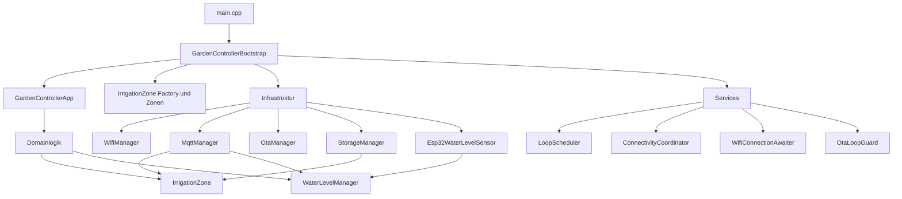
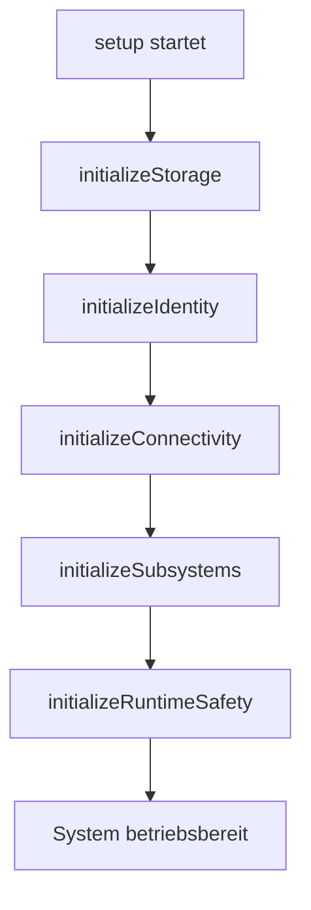
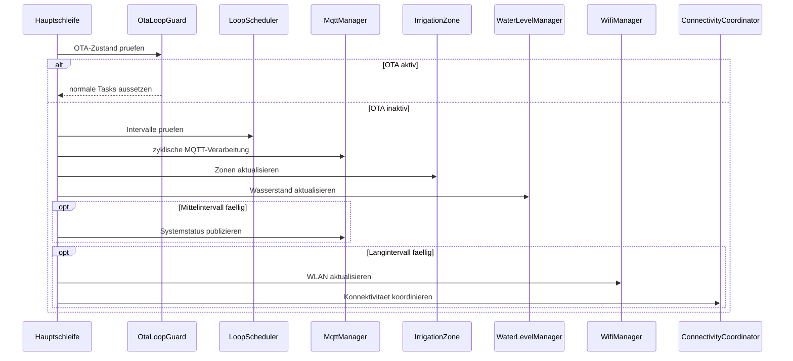

# Entwicklerdokumentation

## Ziel des Projekts

`GardenIrrigationControl` ist eine modulare ESP32-Firmware fuer Gartenbewaesserung mit diesen Schwerpunkten:

- klare Trennung von Fachlogik und Infrastruktur
- testbare Kernlogik per nativen Unit-Tests
- MQTT-basierte Integration
- robuste Laufzeit mit Watchdog, Reconnect und OTA

## Architekturueberblick

Der Code ist fachlich in Unterordner gegliedert:

- `src/app`
  Enthaelt Einstiegspunkt, Bootstrap und App-Orchestrierung
- `src/config`
  Strukturierte Konfigurationsobjekte und Default-Werte
- `src/contracts`
  Abstraktionen / Interfaces
- `src/domain`
  Fachlogik ohne starke Plattformbindung
- `src/infrastructure`
  ESP32-, WLAN-, MQTT-, OTA- und Storage-spezifische Implementierungen
- `src/services`
  kleine technische Hilfs- und Koordinationsbausteine

### Diagramm: Systemarchitektur



## Wichtige Einstiegspunkte

### `src/app/main.cpp`

Minimaler Firmware-Einstiegspunkt. Hier wird die App nicht direkt aufgebaut,
sondern ueber den Bootstrap bezogen.

### `src/app/gardencontrollerbootstrap.h`

Composition Root.

Hier werden konkrete Implementierungen erzeugt und verdrahtet:

- `WifiManager`
- `MqttManager`
- `OtaManager`
- `WaterLevelManager`
- `ConnectivityCoordinator`
- `WifiConnectionAwaiter`
- `OtaLoopGuard`
- `LoopScheduler`
- `IrrigationZone[]`

### `src/app/gardencontrollerapp.h`

Reiner Orchestrator mit injizierten Abhaengigkeiten.

Die App enthaelt keine fachliche Objekt-Erzeugung mehr, sondern nur noch Ablaufsteuerung.

## Startablauf

Der Start erfolgt in `GardenControllerApp::setup()` in klar getrennten Phasen:

1. `initializeStorage()`
2. `initializeIdentity()`
3. `initializeConnectivity()`
4. `initializeSubsystems()`
5. `initializeRuntimeSafety()`

Diese Reihenfolge ist bewusst stabil gehalten und durch native Tests abgesichert.

### Diagramm: Setup-Reihenfolge



## Hauptschleife

Die Endlosschleife arbeitet intervallbasiert.

Verantwortung:

- Watchdog zuruecksetzen
- OTA-Update-Phase respektieren
- kurze, mittlere und lange Intervalle getrennt ausfuehren

Die Intervallentscheidung erfolgt ueber `LoopScheduler`.

### Kurzintervall

- MQTT-Loop
- MQTT-Publishes fuer Zonen
- Zonen-Loop
- Wasserstands-Loop

### Mittelintervall

- Systemstatus publizieren

### Langintervall

- WLAN-Loop
- Connectivity-Koordination

### Diagramm: Laufzeitverhalten der Hauptschleife



## Fachmodule

### `IrrigationZone`

Zustaendig fuer:

- Tasterverarbeitung
- Relaissteuerung
- Timer fuer Laufzeit
- Persistenz der Zonendauer

Wichtige Punkte:

- Debounce ist konfigurierbar
- Laufzeit-Default kommt aus `IrrigationConfig`
- Persistenz laeuft ueber `StorageManager`

### `WaterLevelManager`

Zustaendig fuer:

- Umrechnung von Rohsensorwerten in Fuellstandswerte
- Hysterese- und Zustandslogik
- Sperre bei niedrigem Wasserstand
- Erkennung von Overflow / Critical Overflow
- MQTT-Seiteneffekte nur bei echten Zustandswechseln

Der Sensorzugriff ist ueber `IWaterLevelSensorReader` abstrahiert.

### `MqttManager`

Zustaendig fuer:

- MQTT-Verbindung
- Publish/Subscribe
- Befehlsverarbeitung
- Last Will Testament / Systemtopics

Die Session-/Retry-Logik ist in `MqttSessionManager` ausgelagert.

### `OtaManager`

Zustaendig fuer:

- OTA-Setup
- OTA-Status
- Fortschrittsmeldungen
- Fehlerbehandlung

`isUpdating()` dient als Kontrollsignal fuer die Hauptschleife.

## Technische Hilfsdienste

### `ConnectivityCoordinator`

Entkoppelt WLAN-Events und MQTT-Reconnect-Verhalten.

### `WifiConnectionAwaiter`

Kapselt das Warten auf eine WLAN-Verbindung mit Zeitquelle per Interface.

### `OtaLoopGuard`

Stellt sicher, dass bei laufendem OTA-Update normale Looptasks ausgesetzt werden.

### `IrrigationZoneFactory`

Kapselt die initiale Verdrahtung einer Zone, damit diese Logik nicht in einer Utility-Klasse oder direkt in der App versteckt ist.

## Konfiguration

Wichtige Konfigurationsstrukturen:

- `HardwareConfig`
- `IrrigationConfig`
- `SystemConfig`
- `WaterLevelConfig`

`config.h` enthaelt die Default-Werte. Im Laufzeitsystem werden moeglichst strukturierte Config-Objekte weitergereicht.

## Teststrategie

Es gibt zwei Hauptarten von Validierung:

### Native Tests

Schnelle Unit-Tests auf dem Host-System, z. B. fuer:

- Zonenlogik
- Wasserstandslogik
- MQTT-Session-State-Machine
- Loop-Scheduler
- OTA-Loop-Guard
- Bootstrap-Vertrag

### ESP32-Build

Zusatzpruefung, dass die Firmware auf dem Zielsystem weiterhin baut.

## Wichtige Designentscheidungen

1. **Dependency Injection statt harter Kopplung**
   Fachlogik bekommt Interfaces oder konfigurierte Implementierungen injiziert.

2. **Composition Root im Bootstrap**
   `GardenControllerApp` erzeugt keine Abhaengigkeiten selbst.

3. **Klare Trennung von Domain und Infrastruktur**
   Dadurch sind native Tests moeglich.

4. **Intervallbasierte Hauptschleife**
   Die App bleibt deterministisch und besser nachvollziehbar.

## Build und Test

Typische Befehle:

```bash
pio run -e az-delivery-devkit-v4-usb
pio test -e native
```

## Hinweise fuer weitere Entwicklung

- Neue Fachlogik moeglichst unter `src/domain` oder `src/services` anlegen
- Plattformspezifische Details in `src/infrastructure` halten
- Neue Abhaengigkeiten im Zweifel ueber `src/contracts` abstrahieren
- Aenderungen an der Orchestrierung nach Moeglichkeit mit nativen Tests absichern

## Zusammenfassung

Das System ist heute so aufgebaut, dass die Laufzeit-Orchestrierung relativ schlank ist,
die Fachlogik testbar bleibt und ESP32-spezifische Details weitgehend getrennt sind.
Damit ist das Projekt gut wartbar und schrittweise weiter ausbaubar.
