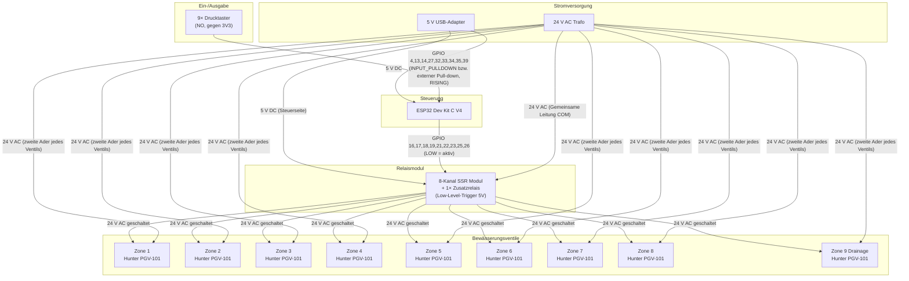

# Schaltplan – GardenIrrigationControl

> Logischer Verdrahtungsplan für ESP32 Dev Kit C V4 + 8-Kanal SSR-Modul + Hunter PGV-101 Ventile

---

## Komponentenübersicht

| Komponente      | Modell                           | Anzahl                | Spannung                              |
| --------------- | -------------------------------- | --------------------- | ------------------------------------- |
| Microcontroller | ESP32 Dev Kit C V4 (AZ-Delivery) | 1                     | 5 V via USB / 3,3 V intern            |
| Relaismodul     | 8-Kanal SSR 5V DC Low-Level      | 1 (+1 Relais separat) | Steuerseite 5 V DC; Lastseite 24 V AC |
| Magnetventil    | Hunter PGV-101                   | 9                     | 24 V AC                               |
| Taster          | Drucktaster, NO (normally open)  | 9                     | 3,3 V (GPIO intern)                   |
| Netzteil        | 24 V AC Trafo                    | 1                     | 24 V AC                               |
| Netzteil        | 5 V USB-Adapter                  | 1                     | 5 V DC                                |

---

## Systemübersicht (Blockdiagramm)



Fallback-Grafik ohne Mermaid-Renderer: [system_overview.svg](system_overview.svg)

---

## Detaillierte GPIO-Belegung

### Eingänge – Drucktaster (INPUT_PULLDOWN, RISING Interrupt)

| Zone   | GPIO    | Board-Label | Hinweis                                                              |
| ------ | ------- | ----------- | -------------------------------------------------------------------- |
| Zone 1 | GPIO 4  | D4          | ✅ Sicher                                                             |
| Zone 2 | GPIO 13 | D13         | ✅ Sicher                                                             |
| Zone 3 | GPIO 14 | D14         | ✅ Sicher                                                             |
| Zone 4 | GPIO 27 | D27         | ✅ Sicher                                                             |
| Zone 5 | GPIO 32 | D32         | ✅ Sicher                                                             |
| Zone 6 | GPIO 33 | D33         | ✅ Sicher                                                             |
| Zone 7 | GPIO 34 | D34         | Input-only; externer Pull-down nötig                                 |
| Zone 8 | GPIO 35 | D35         | Input-only; externer Pull-down nötig                                 |
| Zone 9 | GPIO 39 | VN          | Input-only; externer Pull-down nötig                                 |

**Verdrahtung Taster:** Ein Pin des Tasters → GPIO-Pin des ESP32. Der andere
Pin → **3V3**. Der Pull-down zieht den Pin im Ruhezustand auf LOW; beim
Drücken wird die Leitung auf 3,3 V gezogen und löst eine RISING-Flanke aus.
GPIO 34, 35 und 39 haben keinen internen Pull-down und benötigen daher je einen
externen Pull-down, z. B. **10 kΩ nach GND**.

### Ausgänge – SSR-Modul (LOW-Level-Trigger)

| Zone   | GPIO    | Board-Label | SSR-Kanal    | Hinweis                         |
| ------ | ------- | ----------- | ------------ | ------------------------------- |
| Zone 1 | GPIO 16 | RX2         | IN1          | ✅                               |
| Zone 2 | GPIO 17 | TX2         | IN2          | ✅                               |
| Zone 3 | GPIO 18 | D18         | IN3          | ✅                               |
| Zone 4 | GPIO 19 | D19         | IN4          | ✅                               |
| Zone 5 | GPIO 21 | D21         | IN5          | ✅                               |
| Zone 6 | GPIO 22 | D22         | IN6          | ✅                               |
| Zone 7 | GPIO 23 | D23         | IN7          | ✅                               |
| Zone 8 | GPIO 25 | D25         | IN8          | ✅                               |
| Zone 9 | GPIO 26 | D26         | Zusatzrelais | ✅                               |

**LOW = Relais schließt → Ventil öffnet. HIGH = Relais öffnet → Ventil geschlossen.**

Die Relais-Pins werden in der Firmware direkt beim Setup zuerst auf HIGH
vorbelegt und erst danach als OUTPUT geschaltet. Damit startet der Output-Latch
im inaktiven Zustand. Für besonders robuste Hardware kann zusätzlich pro
SSR-Eingang ein **10-kΩ-Pull-up nach 3V3** vorgesehen werden, sofern das
SSR-Modul 3,3 V am Eingang sicher als HIGH erkennt.

### Status-LED direkt am Relais-Ausgang

Wenn die LED den realen Schaltzustand je Zone zeigen soll, wird sie an der
24-V-AC-Lastseite des jeweiligen Relaiskanals angeschlossen. Dadurch entspricht
die Anzeige dem tatsächlich geschalteten Ausgang, nicht nur dem GPIO-Zustand.

Pro Zone wird eine kleine DIY-LED-Schaltung verwendet:

| Bauteil | Wert / Typ | Zweck |
| ------- | ---------- | ----- |
| LED1    | 5-mm-LED, Farbe nach Wunsch | Statusanzeige |
| R1      | 6,8 kΩ / 0,5 W | Strombegrenzung |
| D1      | 1N4148 oder 1N4007 | Schutzdiode antiparallel zur LED |


Verdrahtung pro Zone:

- R1 liegt in Reihe zur LED.
- D1 liegt antiparallel zur LED.
- Die Kathode von D1, markiert durch den Ring/Strich, kommt an die LED-Anode.
- Die LED-Schaltung wird parallel zum jeweiligen 24-V-AC-Ventilausgang angeschlossen.
- Bei aktivem Relaiskanal leuchtet die LED zusammen mit dem Ventil.

Die komplette Detailbeschreibung steht in
[led_24vac_diy.md](led_24vac_diy.md).

### Sensorik

Der DHT11 wird in dieser Hardware-Variante nicht verwendet und ist daher nicht
verdrahtet.

---

## Verdrahtungsschema – SSR-Modul

```
ESP32 GPIO (z.B. GPIO16) ──────────────────► SSR IN1
                                              SSR GND ── ESP32 GND

24 V AC Trafo Klemme L1 ──────────────────► SSR COM (gemeinsame Eingangsleitung)
SSR NO1 (Normally Open, Ausgang) ─────────► Hunter PGV-101 Ventil Zone 1 (Klemme A)
24 V AC Trafo Klemme L2 ──────────────────► Hunter PGV-101 Ventil Zone 1 (Klemme B)
                                              (gemeinsame Rückleitung für alle Ventile)
```

### Vereinfachter Stromkreis je Zone

```
24V AC L1 ── [SSR COM] ── [SSR Ausgang bei LOW] ── [Ventil +] ── [Ventil –] ── 24V AC L2
```

---

## Spannungsversorgungsplan

```
Steckdose 230V AC
│
├── 24V AC Trafo ──► L1 → SSR-COM (alle Kanäle gemeinsam)
│                    L2 → Gemeinsame Rückleitung aller Ventile (Hunter COM)
│
└── 5V USB-Netzteil ──► USB → ESP32 (5V)
                         5V → SSR VCC (Steuerseite)
                         GND → ESP32 GND = SSR GND (gemeinsame Masse!)
```

> **Wichtig:** ESP32 GND und SSR Steuer-GND müssen verbunden sein. Die 24V-AC-Seite ist galvanisch getrennt.

---

## Bekannte Hardware-Risiken

| #   | Problem                                                 | Schwere  | Empfehlung                                                                                                                 |
| --- | ------------------------------------------------------- | -------- | -------------------------------------------------------------------------------------------------------------------------- |
| 1   | 8-Kanal SSR + 1 Zusatzrelais: Modul hat nur 8 Kanäle    | ✅ Gelöst | Separates Relais für Zone 9 vorhanden                                                                                      |
| 2   | LOW-active SSR-Eingänge können während ESP32-Reset floaten | ⚠️ Niedrig | Firmware setzt Relaispins vor `pinMode(OUTPUT)` auf HIGH; optional 10-kΩ-Pull-up je SSR-Eingang nach 3V3 prüfen |
| 3   | Hunter PGV-101 ist 24V AC, SSR muss AC-fähig sein          | ✅ Gelöst | 24V AC Netzteil vorhanden; SSR auf AC-Eignung geprüft                                                           |
| 4   | Kein Schutz gegen Überstrom/Kurzschluss der Ventilseite    | ⚠️ Mittel | Feinsicherung 1A pro Ventilkreis oder Gruppenabsicherung                                                        |
